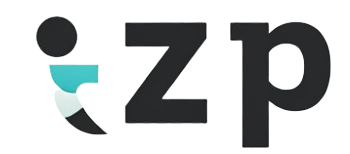

<div align="center">
  

  # ZenPulse: Empowering Mental Wellness

  [](https://flask.palletsprojects.com/)
  [](https://www.python.org/)
  [](https://www.sqlite.org/)
  [](https://developer.mozilla.org/en-US/docs/Web/JavaScript)
  [](https://opensource.org/licenses/MIT)

  <strong>Nurture Your Mind, Empower Your Well-being</strong>

  [Features](#-key-features) • [Getting Started](#-getting-started) • [Tech Stack](#%EF%B8%8F-tech-stack) • [Contributing](#-contributing) • [License](#-license)
</div>

---

## 🌟 Key Features

<table>
  <tr>
    <td width="50%">
      <h3>🤖 AI-powered Chatbot</h3>
      <p>24/7 emotional support and guidance from our virtual psychiatrist.</p>
    </td>
    <td width="50%">
      <h3>📊 Mood Tracking</h3>
      <p>Visualize your emotional journey with interactive charts and insights.</p>
    </td>
  </tr>
  <tr>
    <td width="50%">
      <h3>🎮 Interactive Games</h3>
      <p>Engage in stress-reducing and cognition-improving activities.</p>
    </td>
    <td width="50%">
      <h3>🐾 Virtual Pet Companion</h3>
      <p>Care for a digital pet to experience the joy of companionship.</p>
    </td>
  </tr>
  <tr>
    <td width="50%">
      <h3>🎵 Personalized Music</h3>
      <p>Access mood-boosting playlists tailored to your emotional state.</p>
    </td>
    <td width="50%">
      <h3>💡 Self-Care Suggestions</h3>
      <p>Receive personalized tips based on your mood and activities.</p>
    </td>
  </tr>
</table>

## 🚀 Live Demo

Experience ZenPulse in action: [ZenPulse Demo](https://your-demo-link-here.com)

<div align="center">
  
</div>

## 🛠 Getting Started

1. **Clone the repository**
   ```bash
   git clone https://github.com/zafar-TechWizard/ZenPulse.git
   cd ZenPulse
   ```

2. **Set up API configuration**
   *Create an `api.py`*
   ```bash
   api_key = "your_groq_api_key_here"
   ```

3. **Install dependencies**
   ```bash
   pip install -r requirements.txt
   ```

4. **Run the application**
   ```bash
   flask run
   ```

5. Open your browser and navigate to 
    ``` 
    http://localhost:5000
    ```

## 🛠️ Tech Stack

<table>
  <tr>
    <td align="center" width="96">
      <a href="https://flask.palletsprojects.com/">
        
      </a>
      <br>Flask
    </td>
    <td align="center" width="96">
      <a href="https://www.python.org/">
        
      </a>
      <br>Python
    </td>
    <td align="center" width="96">
      <a href="https://www.sqlite.org/">
        
      </a>
      <br>SQLite
    </td>
    <td align="center" width="96">
      <a href="https://developer.mozilla.org/en-US/docs/Web/JavaScript">
        
      </a>
      <br>JavaScript
    </td>
    <td align="center" width="96">
      <a href="https://groq.com/">
        
      </a>
      <br>GROQ API
    </td>
  </tr>
</table>

## 📁 Project Structure

```
ZenPulse/
│
├── static/
│   ├── css/
│   │   ├── dashboard.css
│   │   ├── gratitude.css
│   │   ├── music.css
│   │   ├── pet.css
│   │   └── style.css
│   ├── js/
│   │   ├── chat.js
│   │   ├── dashboard.js
│   │   ├── main.js
│   │   ├── music.js
│   │   └── pet.js
│   └── images/
│
├── templates/
│   ├── chat.html
│   ├── dashboard.html
│   ├── edit_gratitude.html
│   ├── games.html
│   ├── gratitude.html
│   ├── index.html
│   ├── login.html
│   ├── music.html
│   ├── pet.html
│   ├── reset_password.html
│   └── signup.html
│
├── api.py
├── app.py
├── model.py
├── requirements.txt
└── README.md
```

## 🤝 Contributing

We welcome contributions to ZenPulse! Please check out our [Contributing Guidelines](CONTRIBUTING.md) for details on how to get started.

## 📄 License

This project is licensed under the MIT License - see the [LICENSE.md](LICENSE.md) file for details.

## 🙏 Acknowledgments

- [Flask](https://flask.palletsprojects.com/) and its extensions
- [GROQ API](https://groq.com/) for powering our AI responses

---

<div align="center">
  <strong>Remember, your mental health matters. ZenPulse is here to support you every step of the way.</strong>
  <br><br>
  <a href="https://your-website.com">Website</a>
  <strong>•</strong>
  <a href="https://twitter.com/your-twitter">Twitter</a>
  <strong>•</strong>
  <a href="https://www.linkedin.com/company/your-linkedin">LinkedIn</a>
</div>